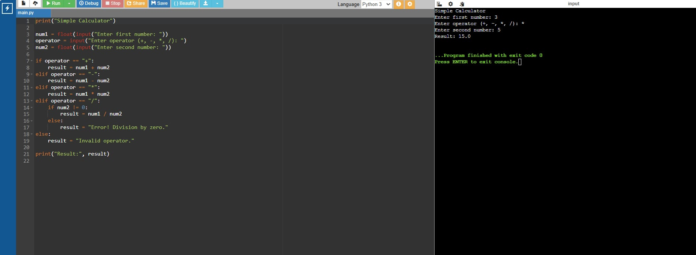

## CpE_Portfolio_Lepar_BSCpE3A

## Personal Information

### Full Name
Nico Jhon B. Lepar

### Course & Section
BSCpE 3A

### About Me
I am a Computer Engineering student interested in programming, embedded systems, and technology development.

### Skills & Technologies
- Basic Programming
- Python Programming
- Problem solving
-HTML
# Projects Section

## Programming Project

### Project Title
Calculator Program

### Description
A simple calculator application for solving basic mathematical operations.

### Technologies Used
- Onlinegdb Python

  ## Project Screenshot

## Screen Design

### Project Title
Online Enrollment System

### Description
An Online Enrollment System is a web-based application designed to simplify and automate the student enrollment process in schools, colleges, or universities. 

### Technologies Used
- Android studio
- HTML

## Project Screenshot

## Web Development Project

### Project Title
Basic Website Design

### Description
A simple responsive website project using HTML and CSS.

### Technologies Used
- HTML
- CSS

# Contact Information

GitHub: yourusername
